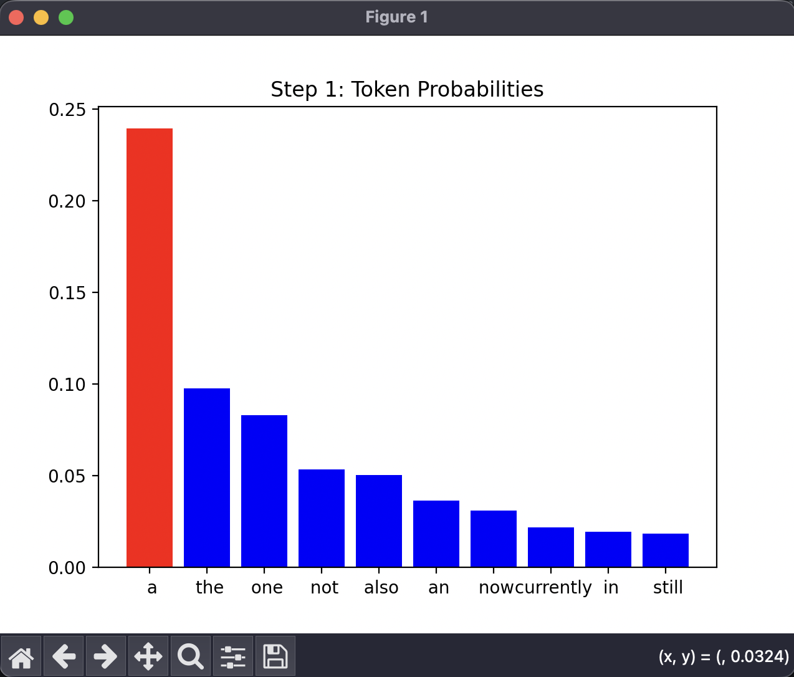
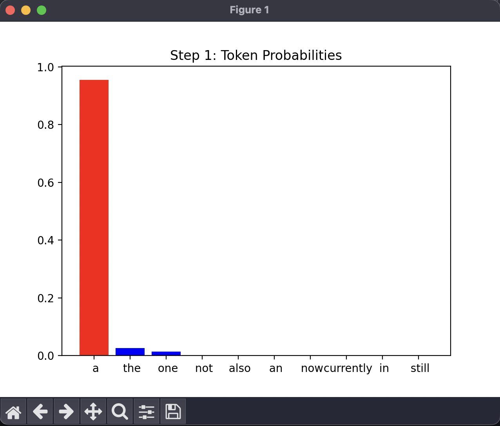

## 1.1 Visualising Token Probabilities

### (a) Code Description and Sample Output

To visualise how the GPT model decies on the next token, I changed the code in both `model.py` and `sample.py`.

In `model.py`, I updated the `generate` function so that, if the `show_probs` flag is set, it collects the top 10 token probabilities at each step of generation. This means for every new token, the model keeps track of which tokens were most likely and what their probabilities were.

In `sample.py`, I added a command-line flag called `--show_probs`. When this flag is used, the script uses Matplotlib to plot a bar chart after each token is generated. THe chart shows the top 10 tokens probabilities, and the token that was actually picked is highlighted in red. This makes it easy to see how confident the model was at each step and which token it chose.

```python
# Added to model.py (inside GPT.generate)

# Before the generation loop
all_probs = []
# Inside the generation loop
top_probs, top_idx = torch.topk(probs, 10)
if show_probs:
    all_probs.append({
        "top_idx": top_idx[0].cpu().tolist(),
        "top_probs": top_probs[0].cpu().tolist(),
        "selected_token": idx_next[0, 0].item()
    })
```

```python
# Added to sample.py (inside the main generation loop)
if show_probs:
    y, all_probs = model.generate(x, max_new_tokens, temperature=temperature, top_k=top_k, show_probs=show_probs)
    print(decode(y[0].tolist()))
    print('---------------')
    # Visualize each step
    for step, prob_info in enumerate(all_probs):
        top_idx = prob_info["top_idx"]
        top_probs = prob_info["top_probs"]
        selected_token = prob_info["selected_token"]
        colors = ['red' if i == selected_token else 'blue' for i in top_idx]
        plt.bar(range(10), top_probs, color=colors)
        plt.xticks(range(10), [decode([i]) for i in top_idx])
        plt.title(f"Step {step+1}: Token Probabilities")
        plt.show()
```

**Sample Output:**

Prompt used: `Wellington is`

Example generated text:
```
Wellington is a man of great service and humility who reflects on
```


### (b) Effect of Temperature on Token Selection

The `temperature` parameter changes how random the model is when picking the next token.

- **Low temperature (e.g., 0.2):** The probability distribution is sharp, so the model almost always picks the most likely token. The bar chart will show one tall bar and the rest very small.
- **High temperature (e.g., 2.0):** The distribution is flatter, so the model is more likely to pick less probable tokens. The chart will show bars that are more even in height.

**Examples:**

- With `temperature=0.2`, the output is predictable.

- With `temperature=1.0`, the output is more varied and interesting.

- With `temperature=2.0`, the output can get random and sometimes doesn't make sense.


**Summary:**
Changing the temperature affects how confident or random the model is. Lower temperature makes the model stick to the most likely tokens, while higher temperature makes it take more risks.

## 1.2 Sequence Probability

### (a) Code Description and Sample Output

To calculate the probability of a generated sequence, I modified the `generate` function in `model.py`.
Now, as each token is generated, I record the probability assigned to that token by the model.
I use log probabilities for each token to avoid numerical underflow, then sum them up and exponentiate the result to get the final sequence probability.

** Code excerpts from `model.py`:**
```python
# Inside GPT.generate
sequence_log_prob = 0.0
for _ in range(max_new_tokens):
    # ...existing code...
    token_prob = probs[0, idx_next[0, 0]].item()
    sequence_log_prob += math.log(token_prob + 1e-10)
    # ...existing code...
sequence_prob = math.exp(sequence_log_prob)
return idx, sequence_prob
```

In `sample.py`, I unpack the returned values and print both the generated text and its probability:
```python
y, sequence_prob = model.generate(x, max_new_tokens, temperature=temperature, top_k=top_k)
print(decode(y[0].tolist()))
print(f"Sequence probability: {sequence_prob:.4e}")
```

**Sample Output:**
Prompt: `I love in`
Settings: `max_new_tokens=5`, `temperature=0.0001`

```
I live in a small town in the
Sequence probability: 1.0000e+00
```

### (b) Assumptions and Use of Log Probabilities

**Assumptions:**
- The probability of the sequence is calculated by multiplying the probabilities of each generated token, assuming each token is conditionally independent given the previous tokens (as per the autoregressive model).

**Why use log probabilities:**
- Multiplying many small probabilities can quickly lead to numerical underflow (values too small for the computer to represent).
- By summing log probabilities instead, we keep the computation stable and avoid underflow.
- At the end, we exponentiate the sum to get the actual probability.

This approach is standard for working with probabilities in long sequences in machine learning.

## 1.3 Probability of a Fixed Sequence

### (a) Code Description and Example Output

To compute the probability of a fixed sequence, I further modified the `generate` function in `model.py` to accept an optional argument called `fixed_response`.
If `fixed_response` is provided (as a list of token IDs), the function uses these tokens instead of sampling, and calculates the probability the model assigns to that exact sequence.

In `sample.py`, I added a variable `fixed_response_text`. If this is set (not empty), the code encodes it into tokens and passes it to `generate` as `fixed_response`. The output is the probability of the model generating that exact sequence after the prompt.

**Code excerpt from `model.py`:**
```python
# Inside GPT.generate
if fixed_response != "":
    for token in fixed_response:
        idx_cond = generated if generated.size(1) <= self.config.block_size else generated[:, -self.config.block_size:]
        logits, _ = self(idx_cond)
        logits = logits[:, -1, :] / temperature
        probs = F.softmax(logits, dim=-1)
        token_prob = probs[0, token].item()
        sequence_log_prob += math.log(token_prob + 1e-10)
        token_tensor = torch.tensor([[token]], device=generated.device)
        generated = torch.cat((generated, token_tensor), dim=1)
    sequence_prob = math.exp(sequence_log_prob)
    return generated, sequence_prob
```

**Code excerpt from `sample.py`:**
```python
if fixed_response_text != "":
    fixed_response_tokens = encode(fixed_response_text)
    y, sequence_prob = model.generate(x, max_new_tokens=len(fixed_response_tokens), temperature=temperature, top_k=top_k, fixed_response=fixed_response_tokens)
    print(decode(y[0].tolist()))
    print(f"Probability of fixed sequence: {sequence_prob:.4e}")
```

**Example Output:**

Prompt: `I live in`
Fixed response: `New Zealand`
Settings: `max_new_tokens=2`, `temperature=1.0`

```
I live in New Zealand
Probability of fixed sequence: 1.9278e-12
```

---

### (b) Effect of Changing Sequence Length

The probability of a sequence is calculated by multiplying the probabilities of each token in the sequence.
As the length of the sequence increases, the overall probability decreases, because you are multiplying more small numbers together.
This means the longer sequences almost always have lower probabilities than shorter ones, even if each token is likely.

**Example:**
- For a short fixed response (e.g., `"NZ"`), the probability was higher (1.0000e-10).
- For a longer fixed response (e.g., `"New Zealand which is a country"`), the probability dropped significantly (4.9344e-17).

This is a general property of autoregressive models: the probability of a sequence is the product of the conditional probabilities of each token given the preious tokens.

## 2.1 Evaluation Harness

### (a) Code Description and Example Evaluation Pairs

For this task, I created a new Python program called `eval.py` to evaluate the GPT model on a set of prompt-response pairs.
The evaluation pairs are stored in a JSON file called `eval_data.json`, which contains a list of objects, each with a `prompt` and a `response`.

**Example contents of `eval_data.json`:**
```json
[
  {"prompt": "I live in", "response": "New Zealand"},
  {"prompt": "The capital of France is", "response": "Paris"}
]
```

In `eval.py`, I adapted the code from `sample.py` to load the model and tokenizer, then defined an `eval` function.
This function reads the evaluation data, encodes each prompt and response, and calls the model's `generate` function with the prompt and the fixed response tokens.
For each pair, it prints the probability that the model assigns to the response, given the prompt, and sums these probabilities.
**Code excerpt from `eval.py`:**
```python
def eval(eval_file):
    with open(eval_file, 'r') as f:
        data = json.load(f)
    total_prob = 0.0
    for pair in data:
        prompt = pair["prompt"]
        response = pair["response"]
        prompt_ids = encode(prompt)
        response_ids = encode(response)
        x = torch.tensor(prompt_ids, dtype=torch.long, device=device)[None, ...]
        _, sequence_prob = model.generate(x, max_new_tokens=len(response_ids), temperature=temperature, top_k=top_k, fixed_response=response_ids)
        print(f'Prompt: {prompt}\nResponse: {response}\nProbability: {sequence_prob:.4e}\n---')
        total_prob += sequence_prob
    print(f"Sum of probabilities: {total_prob:.4e}")
```
**Example output:**
```
Prompt: I live in
Response: New Zealand
Probability: 9.98413e-13
---
Prompt: The capital of France is
Response: Paris
Probability: 1.0000e-10
---
Sum of probabilities: 1.0100e-10
```

---

### (b) How the `eval` Function Runs

When `eval.py` is executed, the following steps occur:

1. The model and tokenizer are loaded.
2. The evaluation data is read from `eval_data.json`.
3. For each prompt-response pair:
   - The prompt and response are encoded into token IDs.
   - The model's `generate` function is called with the prompt and the fixed response.
   - The probability assigned by the model to the reponse is calculated and printed.
4. The probabilities for all pairs are summed and printed at the end.

This harness allows for a straightforward comparison of how likely the model is to produce specific responses to given prompts, which is useful for evaluating the effects of fine-tuning or other changes to the model.

---

## 2.2 Dataset Selection and Evaluation Set

### (a) Corpus Description

FOr fine-tuning my GPT model, I selected the [cricket-rules dataset](https://huggingface.co/datasets/srivats666/cricket-rules) from Hugging Face.
This corpus contains the rules and regulations of cricket in English. The language is highly specialised, featuring technical terms and concepts unique to cricket, such as "LWB" (Leg Before Wicket), "Super Over", "powerplay", and "Duckworth-Lewis method".
The dataset is structured as question-answer pairs, which makes it suitable for training and evaluating models on factual recall and rule-based reasoning in the domain of cricket.

### (b) Evaluation Set Creation

To create my evaluation set, I hand-crafted a set of prompt-response pairs based on key concepts and rules from the cricket-rules dataset.
I chose this approach to ensure coverage of important rules and terminology, and to model the human alignment process described in the assignment.
Hand-crafting allows me to select questions that are representative of the specialised language and knowledge found in the corpus, and to write clear, accurate responses.

**Example evaluation pairs (from `eval_data.json`):**
```json
[
    {
        "prompt": "What is the penalty for a bowler delivering a no-ball in Twenty20 cricket?",
        "response": "The batting team is awarded one run and the next delivery is a free hit."
    },
    {
        "prompt": "How many players must a cricket team have to start a match?",
        "response": "A team must have at least 11 players to start a match."
    },
]
```

I saved these pairs in `eval_data.json` for use with my evaluation harness.

**Justification:**
Hand-crafting the evaluation set ensures that the prompts are clear, relevant, and cover a broad range of cricket rules. This method also allows for targeted assessment of the model's ability to recall and apply domain-specific knowledge after fine-tuning.