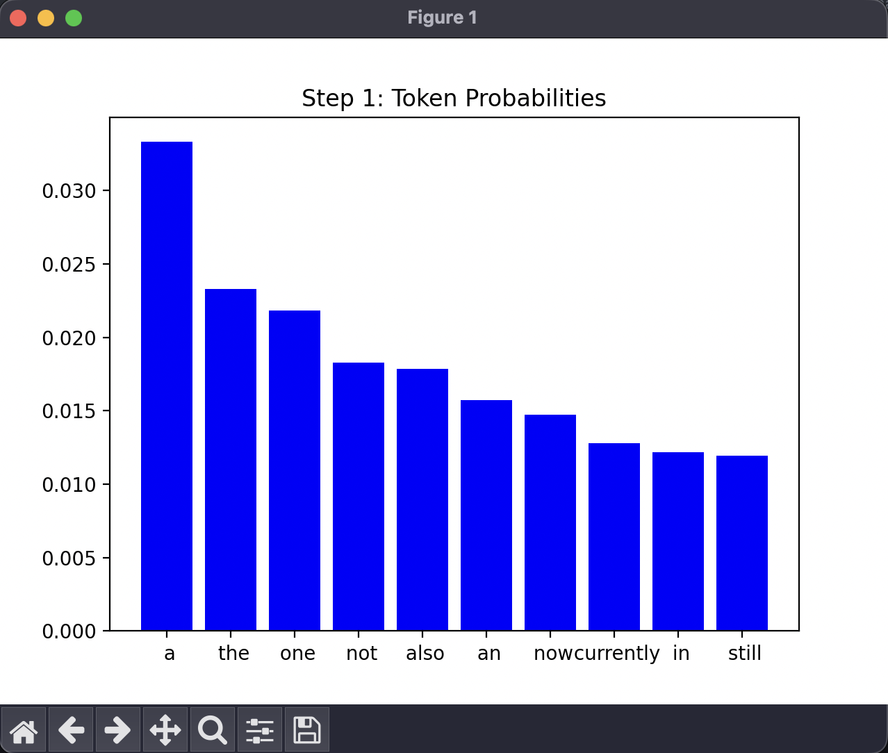

## 1.1 Visualising Token Probabilities

### (a) Code Description and Sample Output

To visualise how the GPT model decies on the next token, I changed the code in both `model.py` and `sample.py`.

In `model.py`, I updated the `generate` function so that, if the `show_probs` flag is set, it collects the top 10 token probabilities at each step of generation. This means for every new token, the model keeps track of which tokens were most likely and what their probabilities were.

In `sample.py`, I added a command-line flag called `--show_probs`. When this flag is used, the script uses Matplotlib to plot a bar chart after each token is generated. THe chart shows the top 10 tokens probabilities, and the token that was actually picked is highlighted in red. This makes it easy to see how confident the model was at each step and which token it chose.

```python
# Added to model.py (inside GPT.generate)
top_probs, top_idx = torch.topk(probs, 10)
if show_probs:
    all_probs.append({
        "top_idx": top_idx[0].cpu().tolist(),
        "top_probs": top_probs[0].cpu().tolist(),
        "selected_token": idx_next[0, 0].item()
    })
```

```python
# Added to sample.py (inside the main generation loop)
if show_probs:
    y, all_probs = model.generate(x, max_new_tokens, temperature=temperature, top_k=top_k, show_probs=show_probs)
    print(decode(y[0].tolist()))
    print('---------------')
    # Visualize each step
    for step, prob_info in enumerate(all_probs):
        top_idx = prob_info["top_idx"]
        top_probs = prob_info["top_probs"]
        selected_token = prob_info["selected_token"]
        colors = ['red' if i == selected_token else 'blue' for i in top_idx]
        plt.bar(range(10), top_probs, color=colors)
        plt.xticks(range(10), [decode([i]) for i in top_idx])
        plt.title(f"Step {step+1}: Token Probabilities")
        plt.show()
```

**Sample Output:**

Prompt used: `Wellington is`

Example generated text:
```
Wellington is a man of great service and humility who reflects on
```


### (b) Effect of Temperature on Token Selection

The `temperature` parameter changes how random the model is when picking the next token.

- **Low temperature (e.g., 0.2):** The probability distribution is sharp, so the model almost always picks the most likely token. The bar chart will show one tall bar and the rest very small.
- **High temperature (e.g., 2.0):** The distribution is flatter, so the model is more likely to pick less probable tokens. The chart will show bars that are more even in height.

**Examples:**

- With `temperature=0.2`, the output is predictable.

- With `temperature=1.0`, the output is more varied and interesting.

- With `temperature=2.0`, the output can get random and sometimes doesn't make sense.


**Summary:**
Changing the temperature affects how confident or random the model is. Lower temperature makes the model stick to the most likely tokens, while higher temperature makes it take more risks.