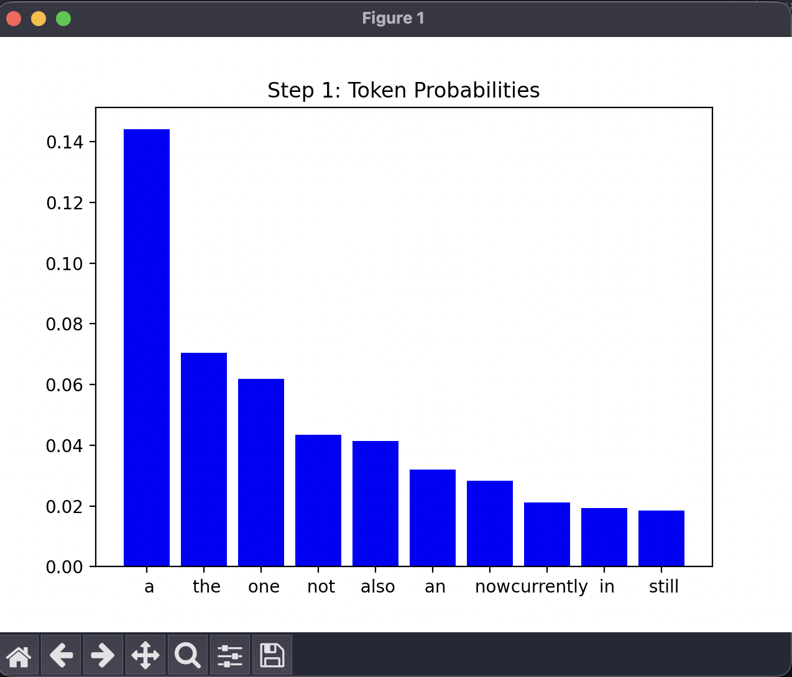

## 1.1 Visualising Token Probabilities

### (a) Code Description and Sample Output

To visualize how the GPT model decides on the next token, I changed the code in both `model.py` and `sample.py`.

In `model.py`, I updated the `generate` function so that, if the `show_probs` flag is set to true, it collects the top 10 token probabilities at each step of generation. This means for every new token, the model keeps track of which tokens were most likely and what their probabilities were.

In `sample.py`, I added a command-line flag called `--show_probs`. When this flag is used, the script uses Matplotlib to plot a bar chart after each token is generated. The chart shows the top 10 tokens probabilities, and the token that was actually picked is highlighted in red. This makes it easy to see how confident the model was at each step and which token it chose.

```python
# Added to model.py (inside GPT.generate)

# Before the generation loop
all_probs = []
# Inside the generation loop
top_probs, top_idx = torch.topk(probs, 10)
if show_probs:
    all_probs.append({
        "top_idx": top_idx[0].cpu().tolist(),
        "top_probs": top_probs[0].cpu().tolist(),
        "selected_token": idx_next[0, 0].item()
    })
```

```python
# Added to sample.py (inside the main generation loop)
if show_probs:
    y, all_probs = model.generate(x, max_new_tokens, temperature=temperature, top_k=top_k, show_probs=show_probs)
    print(decode(y[0].tolist()))
    print('---------------')
    # Visualize each step
    for step, prob_info in enumerate(all_probs):
        top_idx = prob_info["top_idx"]
        top_probs = prob_info["top_probs"]
        selected_token = prob_info["selected_token"]
        colors = ['red' if i == selected_token else 'blue' for i in top_idx]
        plt.bar(range(10), top_probs, color=colors)
        plt.xticks(range(10), [decode([i]) for i in top_idx])
        plt.title(f"Step {step+1}: Token Probabilities")
        plt.show()
```

**Sample Output:**

Prompt used: `Wellington is`

Example generated text:
```
Wellington is a man of great service and humility who reflects on
```


### (b) Effect of Temperature on Token Selection

The `temperature` parameter changes how random the model is when picking the next token.

- **Low temperature (e.g., 0.2):** The probability distribution is sharp, so the model almost always picks the most likely token. The bar chart will show one tall bar and the rest very small.
- **High temperature (e.g., 2.0):** The distribution is flatter, so the model is more likely to pick less probable tokens. The chart will show bars that are more even in height.

**Examples:**

- With `temperature=0.2`, the output is predictable.

- With `temperature=1.0`, the output is more varied and interesting.

- With `temperature=2.0`, the output can get random and sometimes doesn't make sense.


**Summary:**
Changing the temperature affects how confident or random the model is. Lower temperature makes the model stick to the most likely tokens, while higher temperature makes it take more risks.

## 1.2 Sequence Probability

### (a) Code Description and Sample Output

To calculate the probability of a generated sequence, I modified the `generate` function in `model.py`.
Now, as each token is generated, I record the probability assigned to that token by the model.
I use log probabilities for each token to avoid numerical underflow, then sum them up and exponentiate the result to get the final sequence probability.

** Code excerpts from `model.py`:**
```python
# Inside GPT.generate
sequence_log_prob = 0.0
for _ in range(max_new_tokens):
    # ...existing code...
    token_prob = probs[0, idx_next[0, 0]].item()
    sequence_log_prob += math.log(token_prob + 1e-10)
    # ...existing code...
sequence_prob = math.exp(sequence_log_prob)
return idx, sequence_prob
```

In `sample.py`, I unpack the returned values and print both the generated text and its probability:
```python
y, sequence_prob = model.generate(x, max_new_tokens, temperature=temperature, top_k=top_k)
print(decode(y[0].tolist()))
print(f"Sequence probability: {sequence_prob:.4e}")
```

**Sample Output:**
Prompt: `I live in`
Settings: `max_new_tokens=5`, `temperature=0.0001`

```
I live in a small town in the
Sequence probability: 1.0000e+00
```

### (b) Assumptions and Use of Log Probabilities

**Assumptions:**
- The probability of the sequence is calculated by multiplying the probabilities of each generated token, assuming each token is conditionally independent given the previous tokens (as per the autoregressive model).

**Why use log probabilities:**
- Multiplying many small probabilities can quickly lead to numerical underflow (values too small for the computer to represent).
- By summing log probabilities instead, we keep the computation stable and avoid underflow.
- At the end, we exponentiate the sum to get the actual probability.

This approach is standard for working with probabilities in long sequences in machine learning.

## 1.3 Probability of a Fixed Sequence

### (a) Code Description and Example Output

To compute the probability of a fixed sequence, I further modified the `generate` function in `model.py` to accept an optional argument called `fixed_response`.
If `fixed_response` is provided (as a list of token IDs), the function uses these tokens instead of sampling, and calculates the probability the model assigns to that exact sequence.

In `sample.py`, I added a variable `fixed_response_text`. If this is set (not empty), the code encodes it into tokens and passes it to `generate` as `fixed_response`. The output is the probability of the model generating that exact sequence after the prompt.

**Code excerpt from `model.py`:**
```python
# Inside GPT.generate
if fixed_response != "":
    for token in fixed_response:
        idx_cond = generated if generated.size(1) <= self.config.block_size else generated[:, -self.config.block_size:]
        logits, _ = self(idx_cond)
        logits = logits[:, -1, :] / temperature
        probs = F.softmax(logits, dim=-1)
        token_prob = probs[0, token].item()
        sequence_log_prob += math.log(token_prob + 1e-10)
        token_tensor = torch.tensor([[token]], device=generated.device)
        generated = torch.cat((generated, token_tensor), dim=1)
    sequence_prob = math.exp(sequence_log_prob)
    return generated, sequence_prob
```

**Code excerpt from `sample.py`:**
```python
if fixed_response_text != "":
    fixed_response_tokens = encode(fixed_response_text)
    y, sequence_prob = model.generate(x, max_new_tokens=len(fixed_response_tokens), temperature=temperature, top_k=top_k, fixed_response=fixed_response_tokens)
    print(decode(y[0].tolist()))
    print(f"Probability of fixed sequence: {sequence_prob:.4e}")
```

**Example Output:**

Prompt: `I live in`
Fixed response: `New Zealand`
Settings: `max_new_tokens=2`, `temperature=1.0`

```
I live in New Zealand
Probability of fixed sequence: 1.9278e-12
```

---

### (b) Effect of Changing Sequence Length

The probability of a sequence is calculated by multiplying the probabilities of each token in the sequence.
As the length of the sequence increases, the overall probability decreases, because you are multiplying more small numbers together.
This means the longer sequences almost always have lower probabilities than shorter ones, even if each token is likely.

**Example:**
- For a short fixed response (e.g., `"NZ"`), the probability was higher (1.0000e-10).
- For a longer fixed response (e.g., `"New Zealand which is a country"`), the probability dropped significantly (4.9344e-17).

This is a general property of autoregressive models: the probability of a sequence is the product of the conditional probabilities of each token given the preious tokens.

## 2.1 Evaluation Harness

### (a) Code Description and Example Evaluation Pairs

For this task, I created a new Python program called `eval.py` to evaluate the GPT model on a set of prompt-response pairs.
The evaluation pairs are stored in a JSON file called `eval_data.json`, which contains a list of objects, each with a `prompt` and a `response`.

**Example contents of `eval_data.json`:**
```json
[
  {"prompt": "I live in", "response": "New Zealand"},
  {"prompt": "The capital of France is", "response": "Paris"}
]
```

In `eval.py`, I adapted the code from `sample.py` to load the model and tokenizer, then defined an `eval` function.
This function reads the evaluation data, encodes each prompt and response, and calls the model's `generate` function with the prompt and the fixed response tokens.
For each pair, it prints the probability that the model assigns to the response, given the prompt, and sums these probabilities.
**Code excerpt from `eval.py`:**
```python
def eval(eval_file):
    with open(eval_file, 'r') as f:
        data = json.load(f)
    total_prob = 0.0
    for pair in data:
        prompt = pair["prompt"]
        response = pair["response"]
        prompt_ids = encode(prompt)
        response_ids = encode(response)
        x = torch.tensor(prompt_ids, dtype=torch.long, device=device)[None, ...]
        _, sequence_prob = model.generate(x, max_new_tokens=len(response_ids), temperature=temperature, top_k=top_k, fixed_response=response_ids)
        print(f'Prompt: {prompt}\nResponse: {response}\nProbability: {sequence_prob:.4e}\n---')
        total_prob += sequence_prob
    print(f"Sum of probabilities: {total_prob:.4e}")
```
**Example output:**
```
Prompt: I live in
Response: New Zealand
Probability: 9.98413e-13
---
Prompt: The capital of France is
Response: Paris
Probability: 1.0000e-10
---
Sum of probabilities: 1.0100e-10
```

---

### (b) How the `eval` Function Runs

When `eval.py` is executed, the following steps occur:

1. The model and tokenizer are loaded.
2. The evaluation data is read from `eval_data.json`.
3. For each prompt-response pair:
   - The prompt and response are encoded into token IDs.
   - The model's `generate` function is called with the prompt and the fixed response.
   - The probability assigned by the model to the reponse is calculated and printed.
4. The probabilities for all pairs are summed and printed at the end.

This harness allows for a straightforward comparison of how likely the model is to produce specific responses to given prompts, which is useful for evaluating the effects of fine-tuning or other changes to the model.

---

## 2.2 Dataset Selection and Evaluation Set

### (a) Corpus Description

FOr fine-tuning my GPT model, I selected the [cricket-rules dataset](https://huggingface.co/datasets/srivats666/cricket-rules) from Hugging Face.
This corpus contains the rules and regulations of cricket in English. The language is highly specialised, featuring technical terms and concepts unique to cricket, such as "LWB" (Leg Before Wicket), "Super Over", "powerplay", and "Duckworth-Lewis method".
The dataset is structured as question-answer pairs, which makes it suitable for training and evaluating models on factual recall and rule-based reasoning in the domain of cricket.

### (b) Evaluation Set Creation

To create my evaluation set, I hand-crafted a set of prompt-response pairs based on key concepts and rules from the cricket-rules dataset.
I chose this approach to ensure coverage of important rules and terminology, and to model the human alignment process described in the assignment.
Hand-crafting allows me to select questions that are representative of the specialised language and knowledge found in the corpus, and to write clear, accurate responses.

**Example evaluation pairs (from `eval_data.json`):**
```json
[
    {
        "prompt": "What is the penalty for a bowler delivering a no-ball in Twenty20 cricket?",
        "response": "The batting team is awarded one run and the next delivery is a free hit."
    },
    {
        "prompt": "How many players must a cricket team have to start a match?",
        "response": "A team must have at least 11 players to start a match."
    },
]
```

I saved these pairs in `eval_data.json` for use with my evaluation harness.

**Justification:**
Hand-crafting the evaluation set ensures that the prompts are clear, relevant, and cover a broad range of cricket rules. This method also allows for targeted assessment of the model's ability to recall and apply domain-specific knowledge after fine-tuning.

---

## 2.3 Fine-Tuning and Evaluation

### (a) Results of Fine-Tuning

To evaluate the effect of fine-tuning, I first ran my `eval.py` harness on the evaluation set both before and after fine-tuning the GPT-2 model on the cricket-rules dataset.

**Before fine-tuning:**
Sum of probabilities: 1.9442e-13

**After fine-tuning:**
Sum of probabilities: 4.2759e-11

This shows that the fine-tuned model assigns much higher probability to the correct cricket-rule responses compared to the base GTP-2 model. Even with a short training run, the model has clearly adapted to the specialised cricket domain, as evidenced by the increased probability scores for the evaluation set.

### (b) Other Evaluation Methods

The evaluation harness measures the probability assigned to exact responses, but there are other ways to assess model performance:

**1. Multi-Choice Accuracy:**
Create set of multiple-choice questions based on the cricket rules, with one correct answer and several distractors. Measure the percentage of times the model selects the correct answer. This tests factual recall and the model's ability to discriminate between similar options.

**2. BLEU or ROUGE Score for Generated Responses:**
Generate responses to prompts using the model and compare them to reference answers using BLEU or ROUGE metrics. These scores measure the overlap between the generated and reference texts, providing a quantitative measure of answer quality and relevance.

Other possible methods include human evaluation (rating and relevance and correctness of answers) or measuring perplexity on a held-out set of cricket-rule text.

---

## 3.1 Code Explanation: The Training Loop in `train.py`

### Introduction

The training loop in `train.py` is the main part of nanoGPT that teaches the model to get better at predicting text. It uses PyTorch to handle the process of updating the model's weights so it learns from the data. Below, I explain the key steps in the loop, wide code snippets and explanations.

### 1. Loading Batches of Data

The loop uses the `get_batch` function to load small chunks of data (batches) from the training set. This is efficient because it uses memory-mapped filed, which means it doesn't load everything into RAM at once.

```python
# Xxtract from train.py
def get_batch(split):
    data = np.memmap(os.path.join(data_dir, f'{split}.bin'), dtype=np.uint16, mode='r')
    ix = torch.randint(len(data) - block_size, (batch_size,))
    x = torch.stack([torch.from_numpy((data[i:i+block_size]).astype(np.int64)) for i in ix])
    y = torch.stack([torch.from_numpy((data[i+1:i+1+block_size]).astype(np.int64)) for i in ix])
    x, y = x.to(device), y.to(device)
    return x, y
```

**Explanation:** This function randomly selects starting points in the data and creates batches of input (`x`) and target (`y`) tokens. It moves them to the correct device (CPU, GPU, or MPS).

### 2. Forward and Backward Passes

For each batch, the model does a forward pass to calculate the loss, then a backward pass to compute gradients.

```python
# Extract from train.py
with ctx:
  logits, loss = model(X, Y)
scaler.scale(loss).backward()
```

**Explanation:** The `ctx` context manager enables mixed precision if available, making training faster and less memory-intensive. The `scaler` handles gradient scaling for stability when using float16.

### 3. Gradient Accumulation

If the batch size is small due to hardware limits, the loop accumulates gradients over several micro-batches before updating the model.

```python
# Extract from train.py
for micro_step in range(gradient_accumulation_steps):
    with ctx:
        logits, loss = model(X, Y)
        loss = loss / gradient_accumulation_steps
    scaler.scale(loss).backward()
```

**Explanation:** This lets us simulate a larger batch size by splitting it into smaller pieces and accumulating gradients.

### 4. Gradient Clipping

To prevent unstable training, gradients are clipped to a maximum value.

```python
# Extract from train.py
if grad_clip != 0.0:
    scaler.unscale_(optimizer)
    torch.nn.utils.clip_grad_norm_(model.parameters(), grad_clip)
```

**Explanation:** Clipping keeps gradients from getting too large, which can cause the model to diverge.

### 5. Optimiser Step and Zeroing Gradients

After accumulating gradients, the optimiser updates the model weights and clears the gradients.

```python
# Extract from train.py
scaler.step(optimizer)
scaler.update()
optimizer.zero_grad(set_to_none=True)
```

**Explanation:** This is the standard way to apply the gradients and prepare for the next batch.

### 6. Evaluation and Checkpointing

Every few steps, the loop checks performance on the validation set and saves a checkpoint if the model improves.

```python
# Extract from train.py
if iter_num % eval_interval == 0 and master_process:
    losses = estimate_loss()
    print(f"step {iter_num}: train loss {losses['train']:.4f}, val loss {losses['val']:.4f}")
    if losses['val'] < best_val_loss or always_save_checkpoint:
        best_val_loss = losses['val']
        torch.save(checkpoint, os.path.join(out_dir, 'ckpt.pt'))
```

**Explanation:** This keeps track of the best model so far and saves it for later use.

### 7. Logging

The loop prints out the current loss, time per iteration, and MFU (Model Flops Utilisation).

```python
print(f"iter {iter_num}: loss {lossf:.4f}, time {dt*1000:.2f}ms, mfu {running_mfu*100:.2f}%")
```

**Explanation:** This helps monitor training progress and hardware efficiency.

### Example Output

```
step 0: train loss 2.2365, val loss 1.9580
iter 0: loss 2.7512, time 30728.83ms, mfu -100.00%
iter 1: loss 1.7412, time 14101.61ms, mfu -100.00%
iter 2: loss 1.9190, time 14202.31ms, mfu -100.00%
iter 3: loss 3.0078, time 14253.28ms, mfu -100.00%
```

### Conclusion

The training loop in `train.py` is a clear example of how to train a transformer model using PyTorch. It covers all the important steps: loading data, calculating loss, updating weights, handling memory limits, and saving progress. By understanding these steps, I can adjust training for different datasets and hardware.

## 3.2 Extension: Beam Search Decoding in nanoGPT

**(a) Description of the Feature and Its Value**

For my extension, I implemented **beam search decoding** in the `generate` function of `model.py` and added support for it in `sample.py`.

Beam search is a decoding strategy that, instead of greedily selecting the most likely next token at each step, keeps track of the top k most probable sequences (beams) as generation progresses. At each step, it expands all current beams by one token, computes their cumulative probabilities, and retains only the top k candidates. This allows the model to explore multiple possible continuations and select the most probable overall sequence, rather than getting stuck in local optima.

*Code Implementation:*

- In `model.py`, I added a `beam_search` flag and a `beam_width` parameter to the `generate` function. When `beam_search=True`, the function maintains a list of beams, expanding and pruning them at each generation step.
- In `sample.py`, I added command-line flags for `beam_search` and `beam_width`, allowing easy switching between greedy, sampling, and beam search decoding.

*Relevant code except from `model.py`:*

```python
if beam_search:
            beams = [(idx, 0.0)]
            for _ in range(max_new_tokens):
                candidates = []
                for seq, seq_log_prob in beams:
                    idx_cond = seq if seq.size(1) <= self.config.block_size else seq[:, -self.config.block_size:]
                    logits, _ = self(idx_cond)
                    logits = logits[:, -1, :] / temperature
                    if top_k is not None:
                        v, _ = torch.topk(logits, min(top_k, logits.size(-1)))
                        logits[logits < v[:, [-1]]] = -float('Inf')
                    probs = F.softmax(logits, dim=-1)
                    top_probs, top_idx = torch.topk(probs, beam_width)
                    for prob, token in zip(top_probs[0], top_idx[0]):
                        new_seq = torch.cat((seq, token.view(1, 1)), dim=1)
                        new_log_prob = seq_log_prob + math.log(prob.item() + 1e-10)
                        candidates.append((new_seq, new_log_prob))
                candidates.sort(key=lambda x: x[1], reverse=True)
                beams = candidates[:beam_width]
            best_seq, best_log_prob = beams[0]
            sequence_prob = math.exp(best_log_prob)
            return best_seq, sequence_prob
```

*What this adds:*

Beam search provides a more robust decoding strategy, especially for tasks where the most probable sequence is desired. It is widely used in machine translation and text generation to improve output quality over greedy or random sampling.

---

**(b) Demonstration and Output**

To demonstrate beam search, I compared outputs for both a fine-tuned cricket rules model and the general domain (GPT-2) using the same prompt across greedy, sampling, and beam search decoding.

*Cricket Domain: `"The rules of cricket state that"`*

| Method      | Command                                                      | Output (truncated)                                           |
| ----------- | ------------------------------------------------------------ | ------------------------------------------------------------ |
| Greedy      | `python sample.py --init_from=resume --out_dir=out-cricketrules --start="The rules of cricket state that" --num_samples=1 --max_new_tokens=30 --temperature=0.0001` | The rules of cricket state that a team must be the same as the one that won the previous match. What is the difference between a captain and a a-list player? |
| Sampling    | `python sample.py --init_from=resume --out_dir=out-cricketrules --start="The rules of cricket state that" --num_samples=3 --max_new_tokens=30 --temperature=1.0` | The rules of cricket state that a team is to lose by four runs after the first over of the next two. ...<br>The rules of cricket state that the batting team has the right to go on the field for the first over of 20 overs. ...<br>The rules of cricket state that the five wicket-score wicket must be below the batting average. ... |
| Beam Search | `python sample.py --init_from=resume --out_dir=out-cricketrules --start="The rules of cricket state that" --num_samples=1 --max_new_tokens=30 --temperature=0.8 --beam_search=True --beam_width=5` | The rules of cricket state that the team that wins the match must be the same as that team that lost the match. What is the difference between a captain and a manager? |

*General Domain: `"The capital of France is"`*

| Method      | Command                                                      | Output (truncated)                                           |
| ----------- | ------------------------------------------------------------ | ------------------------------------------------------------ |
| Greedy      | `python sample.py --init_from=gpt2 --start="The capital of France is" --num_samples=1 --max_new_tokens=20 --temperature=0.0001` | The capital of France is the capital of the French Republic, and the capital of the French Republic is the capital of the French ... |
| Sampling    | `python sample.py --init_from=gpt2 --start="The capital of France is" --num_samples=3 --max_new_tokens=20 --temperature=1.0` | The capital of France is a capital city.<br>The capital of France is at the centre of much of the anti-immigration debate. ... |
| Beam Search | `python sample.py --init_from=gpt2 --start="The capital of France is" --num_samples=1 --max_new_tokens=20 --temperature=1.0 --beam_search=True --beam_width=5` | The capital of France is the capital of France. It is the capital of France. It is the capital of France. It ... |

------

*Comparison:*

- In both domains, beam search produced outputs similar to greedy/sampling decoding, and did not yield significantly more accurate or diverse completions.
- In the cricket domain, this is likely due to limited fine-tuning–the model does not have strong enough priors to benefit from beam search.
- In the general domain, the model tended to repeat itself, indicating that the probability distribution is highly peaked and repetitive for these prompts.

*Reflection:*

Beam search is most effective when the model is well-trained and the probability distribution over tokens is rich and diverse. In my experiments, the lack of improvement from beam search highlights the importance of model quality and prompt design. With more extensive fine-tuning or more informative prompts, beam search could help select more coherent or accurate completions.